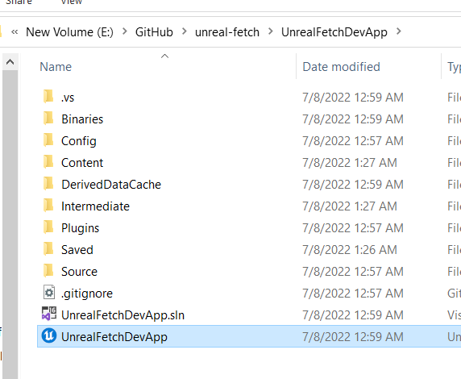
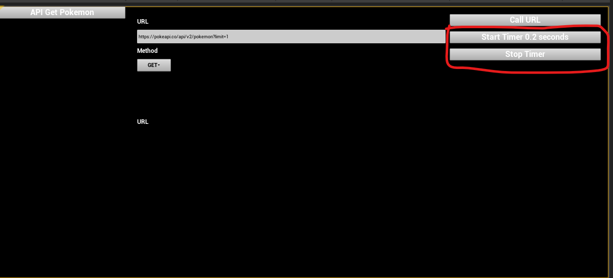
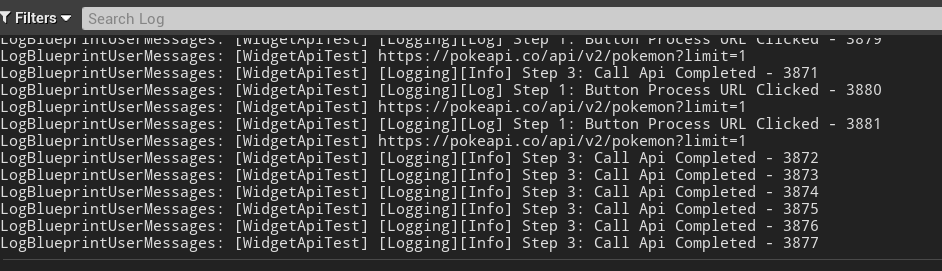

# Issue: Cannot get all responses

## Issue Explain

I do testing to call api GET but sometimes event on Json and on Error doesn't occur.
API Link: https://pokeapi.co/api/v2/pokemon?limit=1
Method: GET

These function are being used in the demo:

- Fetch Json
- On Json
- On Error

I running timer to call api every 0.2 seconds.

I write log and detect following issue:

Called 5140 times but I cannot detect the 35 responses both OnJson and On Error event
I don't know why 35 api cannot get response or error. I did tried with my own api in AWS by using lambda and api gateway too. And the servers doesn't count any error. So I'm confident that api still be fine.

## Reproduce this issue

- Step 1: Open UnrealFetchDevApp by Unreal Editor
  

- Step 2: Open level /Content/Developers/tiendattran/DatTestUI
  

- Step 3: Click on button "Start Timer 0.2 seconds" - It's mean it'll call api every 0.2 seconds.
  

- Step 4: Read the log from Output Log tab. Please click on button "Stop Timer" to see different index between process and on binding event.
  You could see that it' already called 3881 api times. But we just received 3877 responses.
  

Question: Why those api cannot get responses? How solve this problem!
